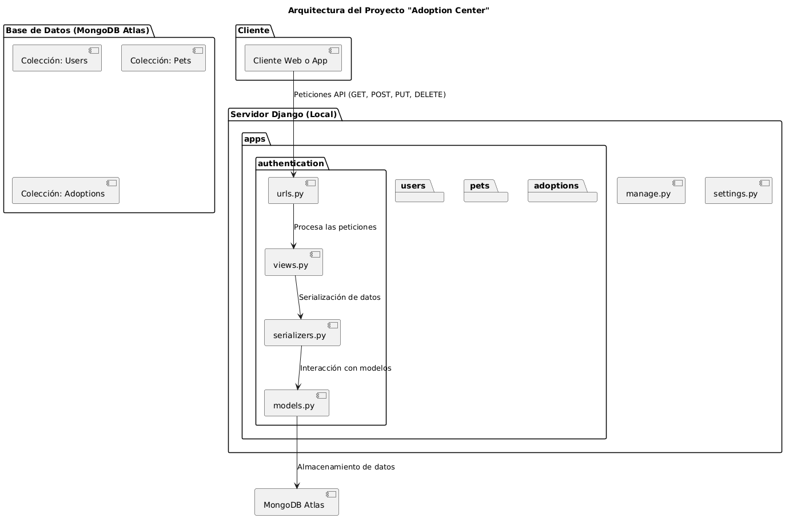

# Adoption Center - Sistema de Adopción de Mascotas

## Indice

1. [Descripcion del Proyecto](#descripcion-del-proyecto)
2. [Objetivo del Proyecto](#objetivo-del-proyecto)
3. [Arquitectura del Proyecto](#arquitectura-del-proyecto)
4. [Instalacion y Configuracion](#instalacion-y-configuracion)
5. [Estructura de Carpetas](#estructura-de-carpetas)
6. [Endpoints Principales](#endpoints-principales)
7. [Seguridad y Permisos](#seguridad-y-permisos)

---

## Descripcion del Proyecto
El con el fin de mejorar la infraestructura de un refugio de animales se ha planteado un "Sistema de Adopcion de Mascotas" como una plataforma diseñada  para gestionar el proceso de adopcion de mascotas. Permitiendo a los usuarios (administradores y adoptantes) visualizar , registrar y administrar mascotas disponibles para adopcion,  ademas de gestionar los usuarios y solicitudes de adopcion.

El sistema esta basado en Django REST Framework y utiliza MongoDB Atlas como base de datos, con un backend alojado en un servidor local.

---

## Objetivo del Proyecto
El objetivo principal del refugio es proporcionar un sistema eficiente y accesible que facilite la gestion de adopciones, mejorando la experiencia de los usuarios y que el proceso se lleve de manera sencilla.


### Funciones clave:
Registro y gestion de usuarios (adoptantes y administradores).
Gestion de mascotas (registro, actualizacion y eliminacion).
Creacion y control de solicitudes de adopcion.
Autenticacion y permisos basados en roles.
API REST para interaccion con aplicaciones externas.

---

## Arquitectura del Proyecto
El sistema sigue un modelo basado en microservicios utilizando Django y Django REST Framework (DRF). La base de datos esta en MongoDB Atlas y el servidor se ejecuta localmente.



---

## Instalacion y Configuracion

### Requisitos Previos

- Python 3.9+
- MongoDB Atlas (Base de datos en la nube)
- Virtualenv (Opcional pero recomendado)

### Instalacion
``` bash
# clonar el repositorio
git clone https://github.com/Ana-Gabs/evaluacion_parcial.git

# Entrar al directorio del proyecto
cd adoption_center

# Crear entorno virtual (opcional)
python -m venv venv
source venv/bin/activate  # En Linux/Mac
venv\Scripts\activate  # En Windows

# Instalar dependencias
pip install -r requirements.txt
```

## Estructura de Carpetas

adoption_center/
│── adoptions/          # App para gestionar adopciones
│── authentication/     # App para autenticacion de usuarios
│── pets/               # App para gestion de mascotas
│── users/              # App para gestion de usuarios
│── venv/               # Entorno virtual de Python
│── manage.py           # Script principal de Django
│── requirements.txt    # Dependencias del proyecto
│── db.sqlite3          # (Solo para pruebas, en produccion se usa MongoDB)
│── .env                # Variables de entorno
│── README.md           # Documentacion del proyecto


## Endpoints Principales
La API cuenta con diferentes endpoints organizados por recursos:

Usuarios
POST /api/auth/register/ - Registra un nuevo usuario.
POST /api/auth/login/ - Inicia sesión y devuelve un token JWT.
GET /api/users/ - Lista los usuarios (requiere permisos de administrador).
Mascotas
GET /api/pets/ - Obtiene la lista de mascotas disponibles.
POST /api/pets/ - Registra una nueva mascota (requiere permisos de administrador).
PUT /api/pets/{id}/ - Modifica los datos de una mascota (requiere permisos de administrador).
DELETE /api/pets/{id}/ - Elimina una mascota (requiere permisos de administrador).
Adopciones
POST /api/adoptions/ - Crea una solicitud de adopción (requiere usuario autenticado).
GET /api/adoptions/ - Lista todas las solicitudes (solo administradores).
PUT /api/adoptions/{id}/ - Actualiza el estado de una solicitud (solo administradores).
DELETE /api/adoptions/{id}/ - Cancela una solicitud de adopción (solo administradores).


## Seguridad y Permisos
El sistema maneja autenticación y permisos mediante JWT y permisos personalizados:

Usuarios anonimos: Solo pueden ver mascotas disponibles.
Usuarios autenticados: Pueden hacer solicitudes de adopcion
Administradores: Pueden gestionar usuarios, mascotas y adopciones.


